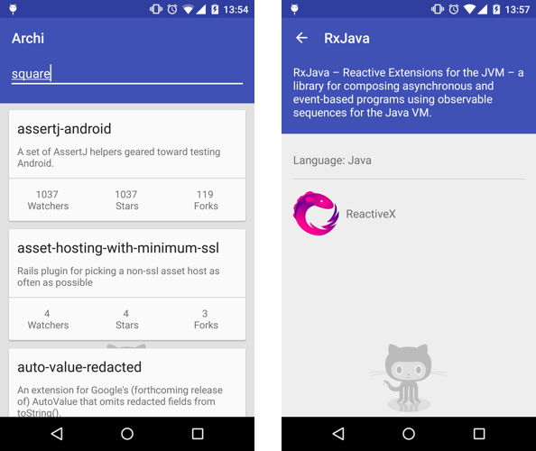

# KArchi
This repository is inspired by [Archi](https://github.com/ivacf/archi) by [ivacf](https://github.com/ivacf). This is
 showcases and compares different architectural patterns in Java and Kotlin. The exact same sample app is built six times using the following approaches:
* Java
  * __Standard Android__: traditional approach with layouts, Activities/Fragments and Model.
  * __MVP__: Model View Presenter.
  * __MVVM__: Model View ViewModel with data binding.
* Kotlin
  * __Standard Android__: traditional approach with layouts, Activities/Fragments and Model.
  * __MVP__: Model View Presenter.
  * __MVVM__: Model View ViewModel with data binding.

## The App

The sample app displays a list of GitHub public repositories for a given username. Tapping on one of them will open a repository details screen, where more information about the repo can be found. This screen also shows information about the owner of the repository.



### Libraries used
* Java & Kotlin
  * AppCompat, CardView and RecyclerView
  * Data Binding (only MVVM)
  * RxJava & RxAndroid
  * Retrofit 2
  * Picasso
  * Mockito
  * Robolectric

* Kotlin
  * [Kotlin Android Extensions](https://kotlinlang.org/docs/tutorials/android-plugin.html)
  * [kapt](https://kotlinlang.org/docs/reference/kapt.html)
  

## Standard Android
The `/app` directoy contains the implementation that follows the traditional standard Android approach. This is a couple of layout files, two Activities and the model. The model is exactly the same for the three implementations and it contains: `Repository`, `User` and a retrofit service (`GithubService`).

With this approach, Activities are in charge of calling the `GithubService`, processing the data and updating the views. They act kind of like a controller in MVC but with some extra responsibilities that should be part of the view. The problem with this standard architecture is that Activities and Fragments can become quite large and very difficult to tests. Hence why I didn't write any unit test for this case.

## MVP - Model View Presenter
In `/app-mvp` you will find the sample app implemented following this pattern. When using mvp, Activities and Fragments become part of the view layer and they delegate most of the work to presenters. Each Activity has a matching presenter that handles accessing the model via the `GithubService`. They also notify the Activities when the data is ready to display. Unit testing presenters becomes very easy by mocking the view layer (Activities).

## MVVM - Model View ViewModel
This pattern has recently started to gain popularity due to the release of the [data binding library](https://developer.android.com/tools/data-binding/guide.html). You will find the implementation in `/app-mvvm`. In this case, ViewModels retrieve data from the model when requested from the view via data binding. With this pattern, Activities and Fragments become very lightweight. Moreover, writting unit tests becomes easier because the ViewModels are decoupled from the view.

## License

```
Licensed under the Apache License, Version 2.0 (the "License");
you may not use this file except in compliance with the License.
You may obtain a copy of the License at

   http://www.apache.org/licenses/LICENSE-2.0

Unless required by applicable law or agreed to in writing, software
distributed under the License is distributed on an "AS IS" BASIS,
WITHOUT WARRANTIES OR CONDITIONS OF ANY KIND, either express or implied.
See the License for the specific language governing permissions and
limitations under the License.
```
